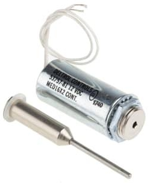
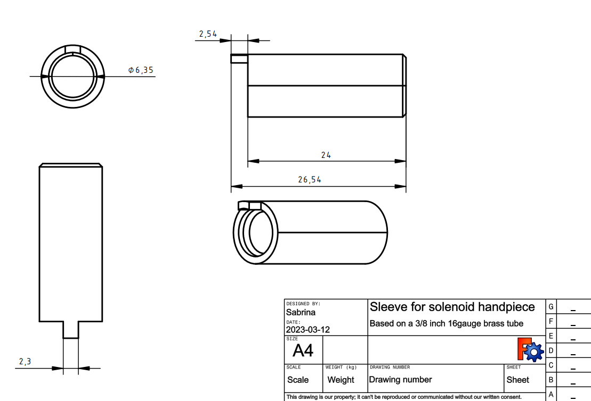
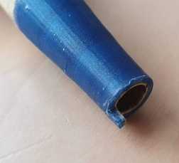
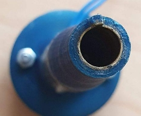
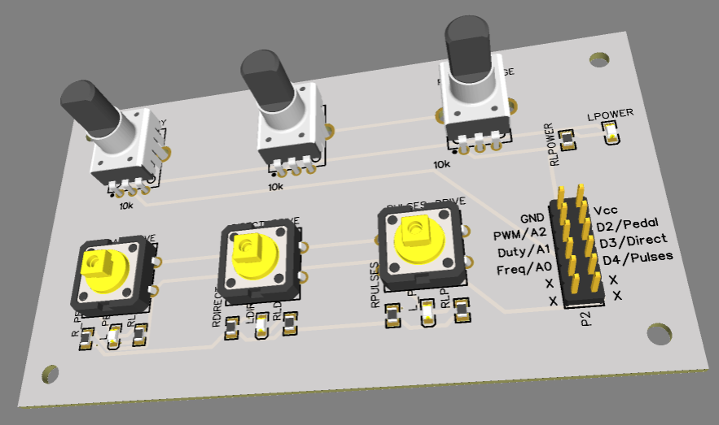
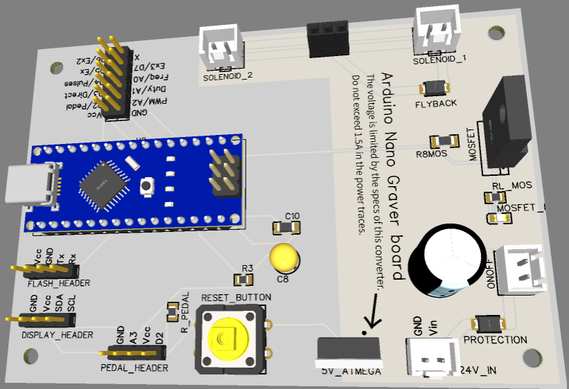

# GraverController
An Arduino Nano based Mosfet controller for solenoid graver.

I got into jewelry making in 2010 to pay for my college expenses. After graduating as a mechanical engineer I realized part of my knowledge should not be wasted and should be applied into something I like.
After looking into the options on a pneumatic graver I realized it was either too expensive or bulky. 
I would not have space for a compressor because I lived in a small room on a shared house.
This is, then, my approach to a solenoid based graver machine.
You could check other approaches like https://github.com/alastair-duncan/SuperEZGraver,  https://www.youtube.com/channel/UCE2rGFm1-xs-WIEHfY1enjA and also my favorite interface https://github.com/Billiam/gravedriver.

The focus I want to bring is of a solenoid for stone setting and fine work, although the power is only limited by the solenoid chosen, buck converter and MOSFET.
You can check videos of it working on [YouTube](https://www.youtube.com/user/selvalss/videos) and the results I got with it [here](https://youtu.be/fjaF6JF7hFk). All tests were performed in the Direct Mode, as programmed in the _Controller_ section below.

If you are handy in terms of Arduino coding and making breadboard circuits this will be super easy to make and program, this will cover mainly a way to make the controller and handpiece with hobby parts. There is also the option to build a custom board with everything integrated already, which is inside the [custom board folder.](https://github.com/Savage-Sabrina/DIY_SolenoidGraver/tree/master/Schematic/Custom%20board%V2) This last option has the benefit of being tidy and you have also all the 3d files to make it look good and functionally tested.

# **Starting the project**
I am sharing this to provide more information on what might be necessary to build your own solenoid engraving machine.

With this I assume that you are:

1. Old enough to know your limitations
1. Liable to your own choices
1. Knowledgeable in electronics

None of the links shared in this guide are affiliate links.

The intent with this guide is to provide knowledge and maybe a bit of opportunity to those who cannot afford a commercial machine or do not have access to the means necessary to get hold of one. I know how it feels to “plan” to buy a machine if we save 50% of our income for the next 5 years to be able to afford the basic version without accessories to run it. No infringement of copyright or patent is intended.

---
# **The solenoid**
The solenoid used should be strong enough to provide the magnetic field but light enough not to be bulky and on the way when engraving. The voltage rating as well as the duty cycle should be compatible with the usage.

A better solution would be to have a commercially available solenoid as the impact source, this would provide some maintenance possibilities. A good choice would be the 12V version of the solenoid 1335. [ITS-LZ-1335-D-24VDC](https://www.elpro.org/gb/red-magnetics-its-lz-series/32677-its-lz-1335-d-24vdc.html) solenoid (The name 1335 means 13mm X 35mm, some companies use the 13x27 which disconsiders the thread length).

The disadvantage of this solenoid is that the diameter of the impact shaft will make it crooked after approx. 300h of use in maximum load (based on tests with impact on an upstanding weight of 40 grams), which is reasonably long but not something to be disregarded.

Another disadvantage of this model is that the solenoid cannot release enough heat and might overheat, solutions to this are:

1. Make a heatsink for it.
2. Manufacture an open handpiece to allow airflow.
3. Usage of a [Flyback Diode](https://en.wikipedia.org/wiki/Flyback_diode) to remove voltage spikes from the coils. **(This one is actually mandatory)**

## **Custom Solenoid**
If you intend to produce your own solenoid there are some considerations that should be put in place that will make your life easier:

1. The plunger for the solenoid should be floating so as to regulate the amplitude of the impact, a smaller amplitude can lead to faster and more delicate impacts, a greater amplitude can be good for the bezel setting or steel engraving. Free floating solenoids like the 1335 above are regulated by putting some limiter in the back to reduce or increase its amplitude like some sort of screw.
1. The plunger weight should be around 6-8 grams to allow flexibility of energy and speed. A 6 g plunger with the right spring and coil can get up to 60 HZ with an amplitude of 3mm. An 8 gram plunger can even engrave steel, with a 5mm amplitude.
1. An open design of the coil to dissipate the heat will make it last and allow it to use the handpiece for longer since it won’t be too hot.
1. Do not forget the flyback diode as mentioned before.
1. Make sure the wire for the coil can handle the voltage and current to avoid melting and increased temperature.

A plunger with the dimensions below and a handmade spring with a 0.2mm wire can yield great results. The advantage of this is to manufacture something that is exclusive to your needs. With these dimensions I was able to engrave steel and also fine tune it to set 1.3mm stones pave style. The 0.7 mm step is the place to fit the spring, this solenoid should be powered at 12V 25% duty cycle maximun.

---
# **The handpiece**
After some iterations and failures I want to bring some insights to the design if you want to use the one developed or project your own.

For a design that can be assembled with minimal tools and an optional 3d printer you can check my page. The good thing about being open is that we can be sure that people will create better options than our own idea.

This design allows you to use a 1335 solenoid and a 9/16 inch brass tube from K&S to enhance the structure of the parts. The tube that fits the [GRS tool holder](https://grs.com/product/grs-quickchange-handle/) is a [5/16 inch tube from K&S metals](https://ksmetals.com/products/br029-5-16?_pos=1&_psq=5%2F16&_ss=e&_v=1.0), it can be used as a sleeve to make the plast stronger and for the collet to slide easier. If you want to make your own design this tube fits in a 3d printed hole of 7.2mm better due to the approximation of a circle to a polygon.
For a better fit, with some adjustments, the standard tube 3/8" 16 gauge will have a tight grip on the GRS collet. Although not ideal it can be sanded up to the allow movement when hit. The tube can be found on steel, which is a bit harder to work but more durable, or brass.
Some other options can be considered, like using machining services offered online for a perfect fit with the internal dimension of 1/4" or 6.35 mm. With this approach you can not only make your own handpiece but also your own quick change handle. The sleeve should look like the image below.

This thicker sleeve would replace the thin K&S Tube pirctured below. I got better results with this snaded version of the brass tube.

---
# **Controller**
For the controller I went with 2 different platforms, one with a Raspberry PI PICO to have a touch interface and better PWM controls and an Arduino to make things cheaper and accessible to the majority of people. I projected a custom board that contains all the components in one, the board is only aimed at people that really know what they are doing, you can find it in the [custom board folder](https://github.com/Savage-Sabrina/DIY_SolenoidGraver/tree/master/Schematic/Custom%20board)

In this document I will handle only the Arduino version of the controller as it is the simplest and readily available. For the Raspberry version I realized that the version of the software installed as well as the version of MicroPython impacted on the controls and had some bugs and differences due to the GPIO.PWM frequency limitations. The parts referenced are just a guideline, they are not exclusive or irreplaceable.

Necessary parts:

1. Arduino (The cheapest one that will work is the [Nano](https://store.arduino.cc/products/arduino-nano), since it’s an open platform you can use a “generic” version)
1. [Mosfet board](https://www.amazon.com/HiLetgo-IRF520-MOSFET-Arduino-Raspberry/dp/B01I1J14MO) (Learn more about MOSFETS [Here](https://dronebotworkshop.com/transistors-mosfets/))
1. Expression pedal ([This](https://www.thomann.de/se/maudio_expression_pedal.htm) was the cheapest in Europe and worked like a charm)
   1. Or a [potentiometer pedal](https://thepihut.com/products/foot-pedal-potentiometer-sewing-machine-speed-controller).
1. PSU (A laptop PSU can fulfill the needs of almost everyone, I could even engrave steel with a 18V 4A)
1. 2X [Potentiometers](https://thepihut.com/products/gravity-analog-rotation-potentiometer-sensor-v1-for-arduino)

Optional parts:

1. [Buck converter](https://thepihut.com/products/dc-dc-power-module-25w) or [this](https://www.amazon.ca/Lysignal-LM2596-Supply-Adjustable-Converter/dp/B074J4NXCM), Make sure the output voltage is set to 5V before you connect the components (Makes only one PSU enough instead of 2 connectors)
1. [Buttons](https://thepihut.com/products/stemma-wired-tactile-push-button-pack-5-color-pack) (If you are going for a more complete programming they are necessary)
1. [Switch](https://thepihut.com/products/mini-panel-mount-dpdt-toggle-switch) (To make it easier to turn the power from the PSU on and off)
1. [Breadboard](https://thepihut.com/products/raspberry-pi-breadboard-half-size) (Makes it easier to connect the wires)

For the Arduino pinout any variant can be used. The model represented in the schematics is the Arduino Nano.

The schematics of the connection is as shown below:

The complete schematics are [in the shared folder](https://github.com/Savage-Sabrina/DIY_SolenoidGraver/tree/master/Schematic) with a .PDF or .PNG file.

What has to be done when assembling it safelly:

1. Check if all the connections are in place apart from the PSU.
1. Connect the Arduino to the pc and use the ArduinoIDE interface to check the code.
1. Upload the [Arduino code](https://github.com/Savage-Sabrina/DIY_SolenoidGraver/blob/34cf9a5d53c3de1b95fa2ae14cb3af24335a9292/Arduino%20Code/BetaVersion0.2LCD+VariableFootPedal.ino) for the desired control, which will have 3 modes:
   1. Frequency mode, you choose the frequency and the duty cycle with the potentiometers, the pedal will change the power input according to the selection, the information is shown on the LCD.
   1. Pulse mode, the handpiece will give a certain amount of pulses according to frequency and duty, the pulses go to maximum power at start and stop for half a second then continue within a defined interval.
   1. Direct mode, the handpiece goes to maximum power instantaneously according to duty and frequency selected.
1. Test the board without the solenoid handpiece or PSU in place and look at the LED of the mosfet to look for it blinking.
2. Use a weaker PSU just to check the main connections.
3. Assemble everything and test it for a split second to verify short circuits in your assembled handpiece. To avoid heating of the handpiece don't forget the Flyback diode.
4. Enjoy!

---
# **Custom board V2**
The custom board below has already the connections made and it's only up to you to connect the power lines, pedal, graver and your own Arduino Nano. You can order the boards on PCB manufacturers that send it to the whole world like PCBWay and JLCPcb.
You can find the design on the [custom board folder.](https://github.com/Savage-Sabrina/DIY_SolenoidGraver/tree/master/Schematic/Custom%20board%V2)
The design is divided in 2 parts, the Arduino Nano Board and the Controll Board with buttons and potentiometers as shown below:

***
# **Final considerations**

If you feel that something should be changed or is wrong feel free to inform me or to perform your own modifications.
Suggestions are always welcome, I had a brief contact with a professional grade engraver in order to feel the impact in the hand and tool behavior which was not enough to feel the nuances of the machine.
If you need assistance with the project please message me on reddit u/Weird\_Singularity.

